# Actividad 5

Este repositorio tiene las evidencias y capturas de pantalla correspondientes a la Act5

## Contenido de Evidencias

### Ejecución General
* **Vista de la aplicación durante su ejecución:**
  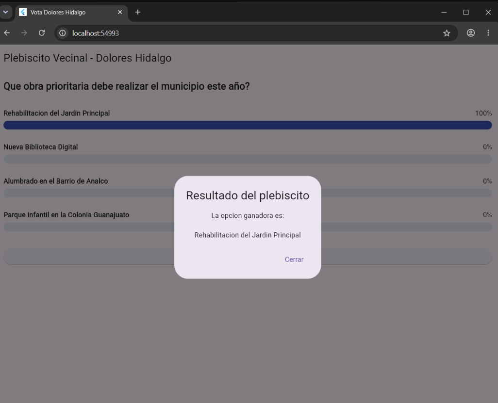

### Pruebas de Casos (Éxito y Fallo)

* **Prueba 1:**
  * **Éxito:**
    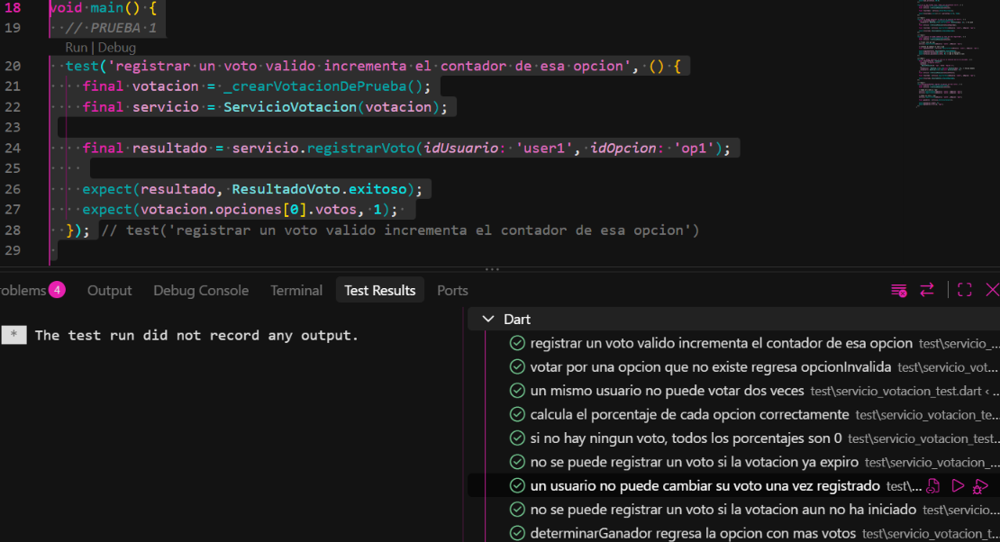
  * **Fallo:**
    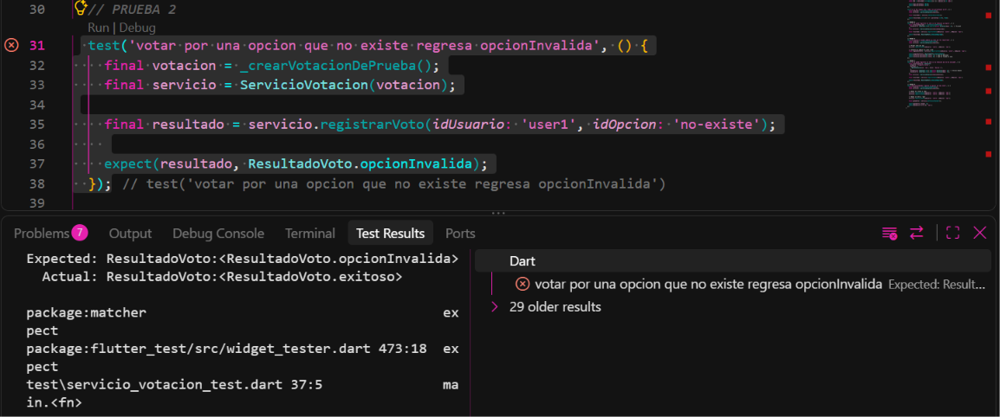

* **Prueba 2:**
  * **Éxito:**
    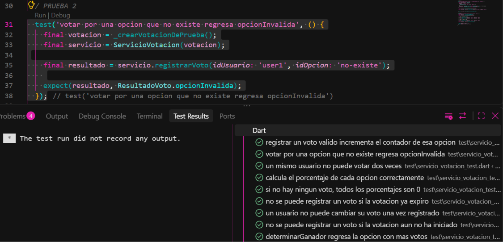
  * **Fallo:**
    

* **Prueba 3:**
  * **Éxito:**
    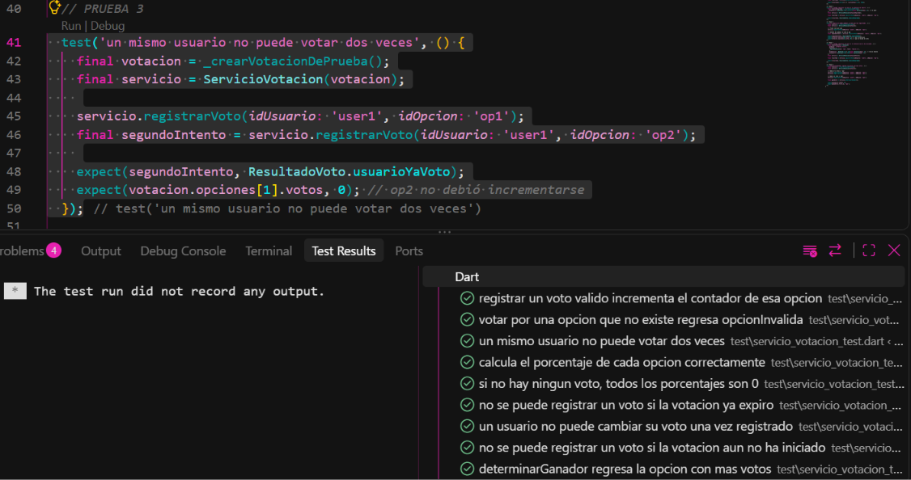
  * **Fallo:**
    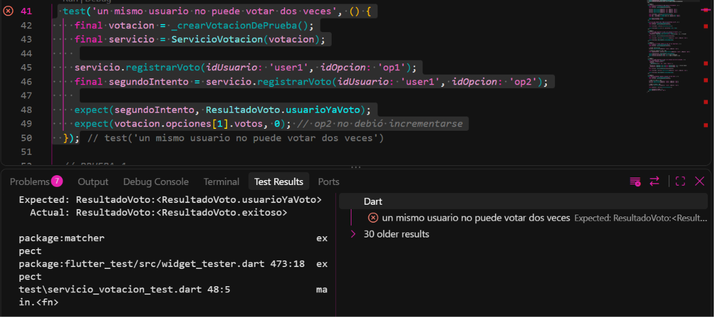

* **Prueba 4:**
  * **Éxito:**
    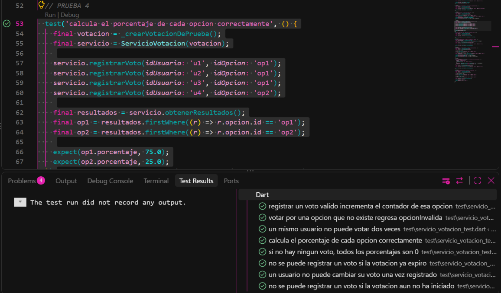
  * **Fallo:**
    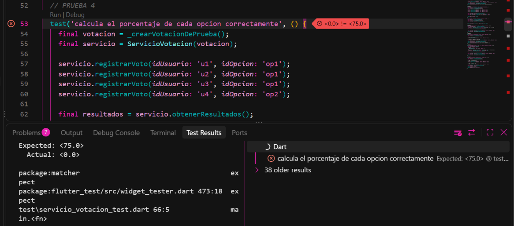

* **Prueba 5:**
  * **Éxito:**
    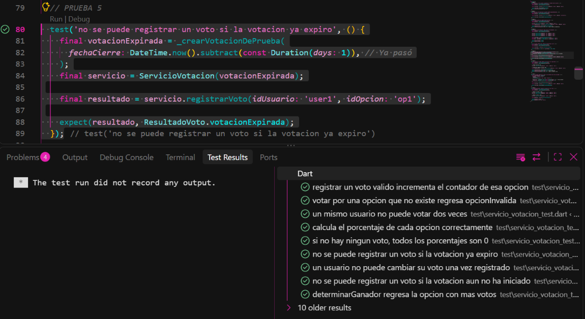
  * **Fallo:**
    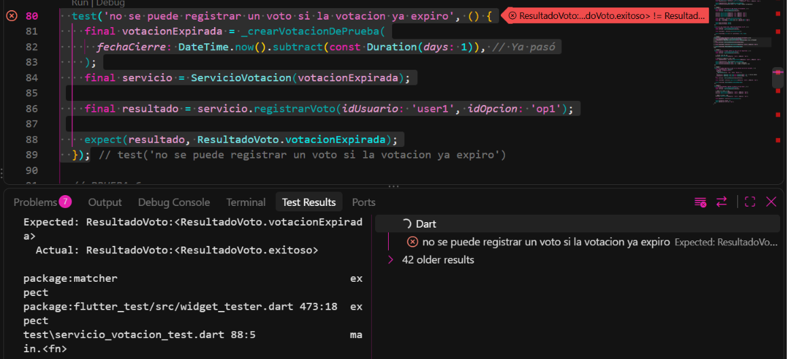

* **Prueba 6:**
  * **Éxito:**
    
  * **Fallo:**
    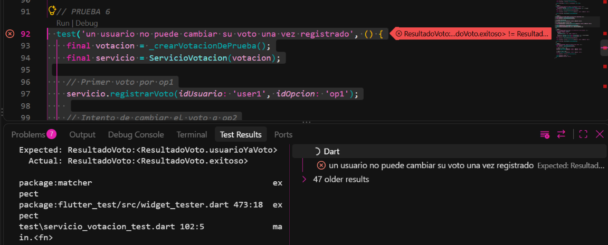

* **Prueba 7:**
  * **Éxito:**
    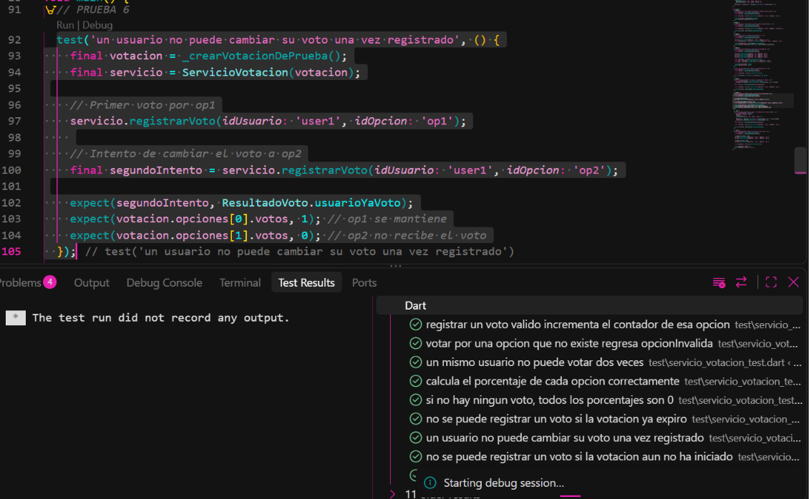
  * **Fallo:**
    

* **Prueba 8:**
  * **Éxito:**
    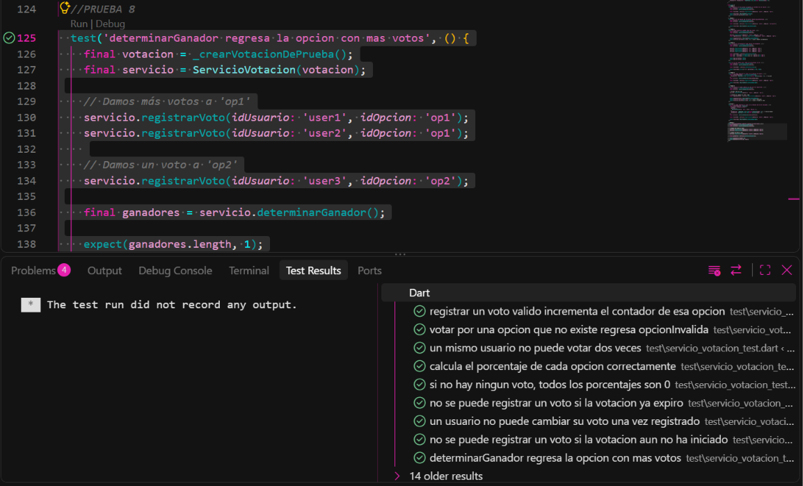
  * **Fallo:**
    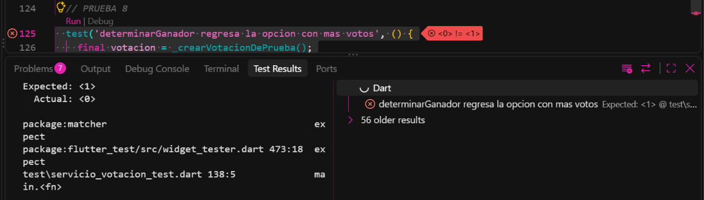

### Integración
* **Prueba de integración del sistema:**
  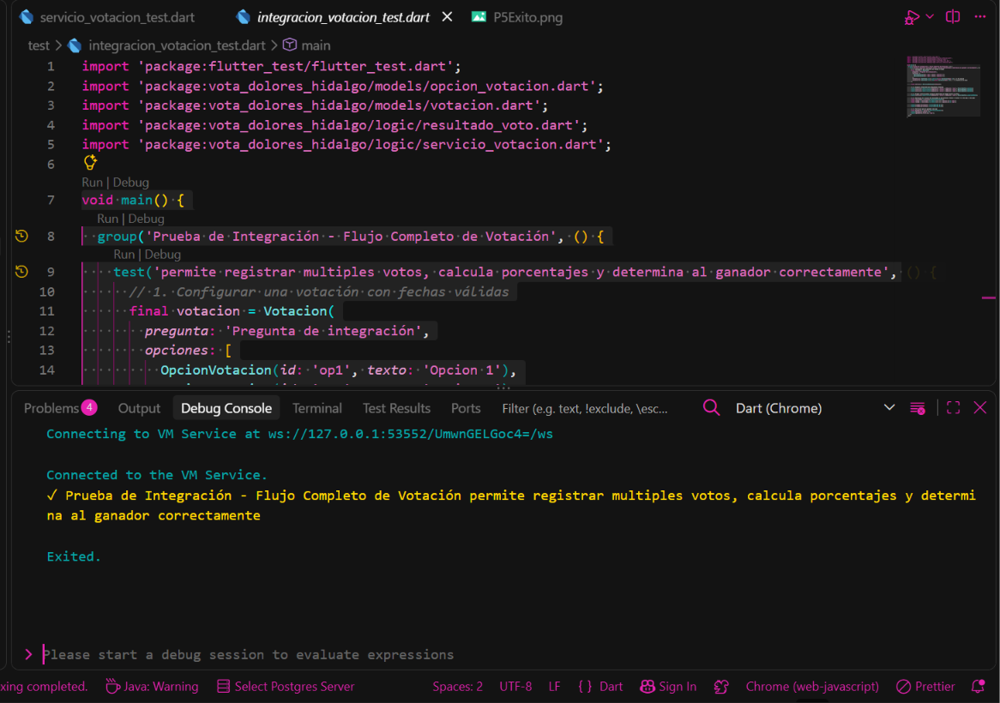
